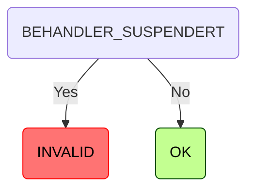

# regulus-regula

Dette er en Kotlin-modul som representerer alle regel-utprøvingene vi gjør i på hver sykmelding vi mottar.

Denne modulen skal i hovedsak kun brukes av:

* regulus-maximus (i mottaket)
* syk-inn-api (i nytt sykmeldings-løp)

## Regeltre

Disse grafene er generert opp av samme kode-struktur som selve reglene er definert med.

Endringer i regel-implementasjonene vil derfor også reflekteres i disse grafene.

<!-- RULE_MARKER_START -->
## 0. Lege suspensjon

<!-- RULE_MARKER_END -->