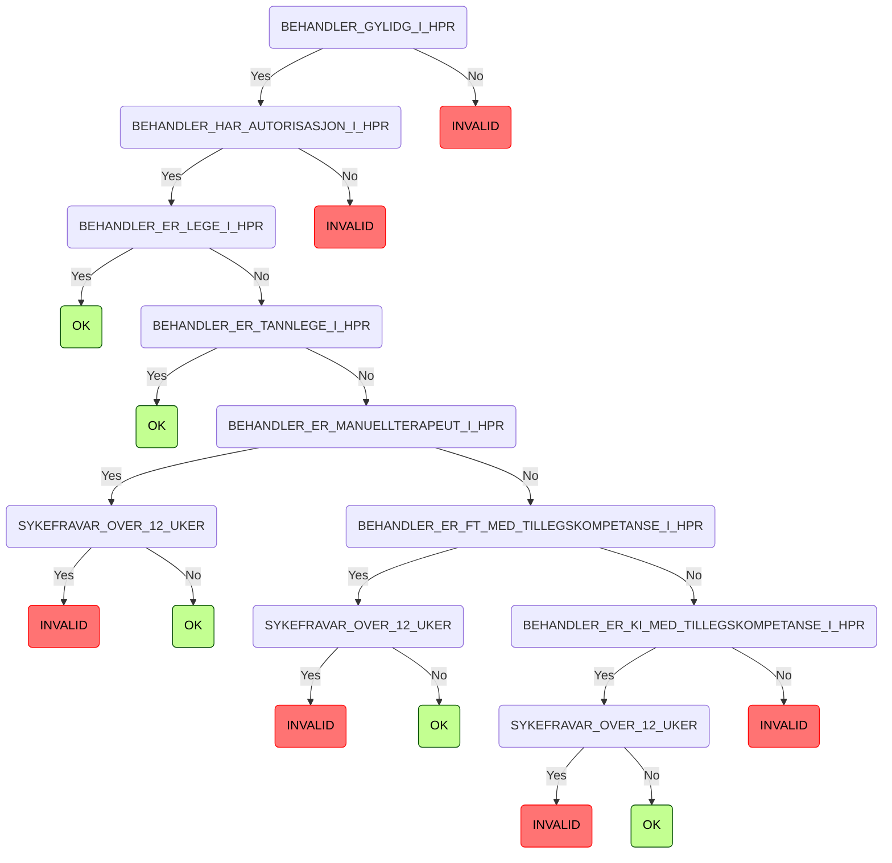

# regulus-regula

Dette er en Kotlin-modul som representerer alle regel-utprøvingene vi gjør i på hver sykmelding vi mottar.

Denne modulen skal i hovedsak kun brukes av:

* regulus-maximus (i mottaket)
* syk-inn-api (i nytt sykmeldings-løp)

## Regeltre

Disse grafene er generert opp av samme kode-struktur som selve reglene er definert med.

Endringer i regel-implementasjonene vil derfor også reflekteres i disse grafene.

<!-- RULE_MARKER_START -->
## 0. Lege suspensjon

## 1. Validation

## 2. HPR

---

- ### Juridisk Henvisning:
  - **Lovverk**: FOLKETRYGDLOVEN
  - **Paragraf**: 8-7
  - **Ledd**: 1

---

<!-- RULE_MARKER_END -->

## Strukturen på et regel-tre

Regeleksekveringsmotoren forventer at reglene består av:

### Overordnet definisjoner

* Et enum som beskriver alle regel-navnene, og utfall for hver regel
  * `enum FooBarRules { ... }`
* Et `tree` som implementerer alle reglene, og deres yes/no utfall
  * `val fooBarTree = treetree<LegeSuspensjonRules, RuleResult>(LegeSuspensjonRules.FirstRule) { ... }`

### Eksekveringsspesifikt

* Et enum som definerer alle regrene, samt alle utfall
  * `enum class FooBarRule { ... }`
* En data-klasse som definerer hvilke verdier dette regel-treet trenger
  * `data class FooBarPayload(...)`
* En klasse som implementerer binder sammen regel-treet og payload
  * `class FooBarRuleExecutor(...): TreeExecutor<FooBarRule, FooBarPayload> { ... }`
* Reglene!
  * En funksjon som sørger for at alle funksjonene er implementert
    * `fun getFooBarRule(rules: FooBarRule): FooBarRuleRuleFn = when { ... }`
  * Et sett med pure functions som implementerer hver regel
    * `typealias FooBarRuleFn = (payload: FooBarPayload) -> RuleOutput<FooBarRules>`
    * `val fooBarRule1: FooBarRuleFn = { payload -> ... }`
    * `val fooBarRule2: FooBarRuleFn = { payload -> ... }`
