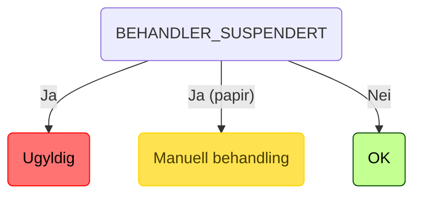
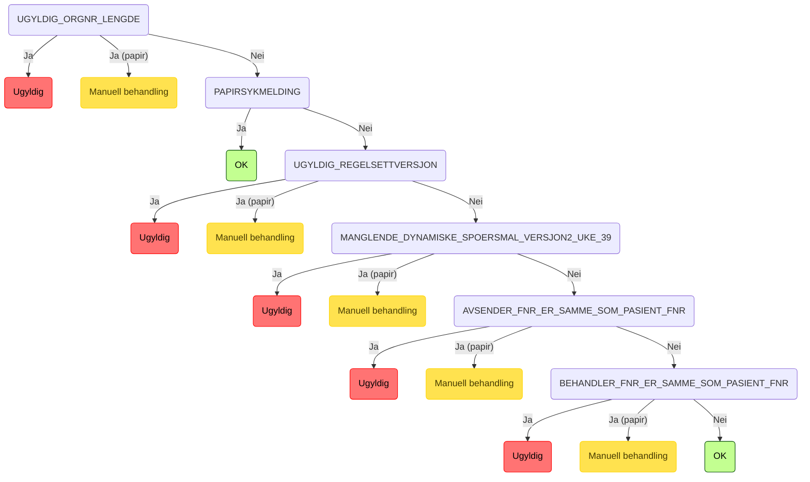
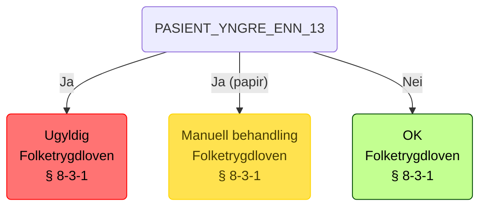
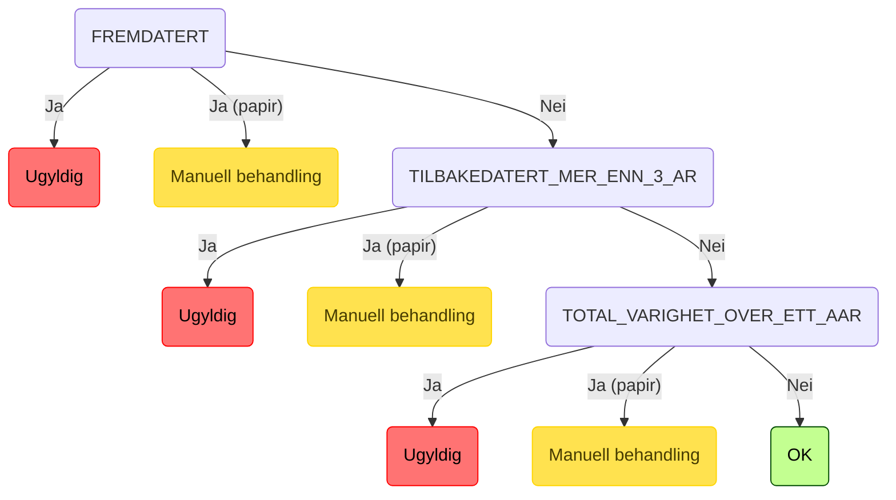

```mermaid
graph TD
    root(TILBAKEDATERING) -->|Ja| root_TILBAKEDATERING_SPESIALISTHELSETJENESTEN(SPESIALISTHELSETJENESTEN)
    root_TILBAKEDATERING_SPESIALISTHELSETJENESTEN(SPESIALISTHELSETJENESTEN) -->|Ja| root_TILBAKEDATERING_SPESIALISTHELSETJENESTEN_OK(OK
Folketrygdloven
 § 8-7-1 1.):::ok
    click root_TILBAKEDATERING_SPESIALISTHELSETJENESTEN_OK "https://lovdata.no/nav/folketrygdloven/kap8#PARAGRAF_8-7" "Gå til lovdata"
    root_TILBAKEDATERING_SPESIALISTHELSETJENESTEN(SPESIALISTHELSETJENESTEN) -->|Nei| root_TILBAKEDATERING_SPESIALISTHELSETJENESTEN_ETTERSENDING(ETTERSENDING)
    root_TILBAKEDATERING_SPESIALISTHELSETJENESTEN_ETTERSENDING(ETTERSENDING) -->|Ja| root_TILBAKEDATERING_SPESIALISTHELSETJENESTEN_ETTERSENDING_OK(OK
Folketrygdloven
 § 8-7-1 1.):::ok
    click root_TILBAKEDATERING_SPESIALISTHELSETJENESTEN_ETTERSENDING_OK "https://lovdata.no/nav/folketrygdloven/kap8#PARAGRAF_8-7" "Gå til lovdata"
    root_TILBAKEDATERING_SPESIALISTHELSETJENESTEN_ETTERSENDING(ETTERSENDING) -->|Nei| root_TILBAKEDATERING_SPESIALISTHELSETJENESTEN_ETTERSENDING_TILBAKEDATERT_INNTIL_4_DAGER(TILBAKEDATERT_INNTIL_4_DAGER)
    root_TILBAKEDATERING_SPESIALISTHELSETJENESTEN_ETTERSENDING_TILBAKEDATERT_INNTIL_4_DAGER(TILBAKEDATERT_INNTIL_4_DAGER) -->|Ja| root_TILBAKEDATERING_SPESIALISTHELSETJENESTEN_ETTERSENDING_TILBAKEDATERT_INNTIL_4_DAGER_OK(OK
Folketrygdloven
 § 8-7-2 2.):::ok
    click root_TILBAKEDATERING_SPESIALISTHELSETJENESTEN_ETTERSENDING_TILBAKEDATERT_INNTIL_4_DAGER_OK "https://lovdata.no/nav/folketrygdloven/kap8#PARAGRAF_8-7" "Gå til lovdata"
    root_TILBAKEDATERING_SPESIALISTHELSETJENESTEN_ETTERSENDING_TILBAKEDATERT_INNTIL_4_DAGER(TILBAKEDATERT_INNTIL_4_DAGER) -->|Nei| root_TILBAKEDATERING_SPESIALISTHELSETJENESTEN_ETTERSENDING_TILBAKEDATERT_INNTIL_4_DAGER_TILBAKEDATERT_INNTIL_8_DAGER(TILBAKEDATERT_INNTIL_8_DAGER)
    root_TILBAKEDATERING_SPESIALISTHELSETJENESTEN_ETTERSENDING_TILBAKEDATERT_INNTIL_4_DAGER_TILBAKEDATERT_INNTIL_8_DAGER(TILBAKEDATERT_INNTIL_8_DAGER) -->|Ja| root_TILBAKEDATERING_SPESIALISTHELSETJENESTEN_ETTERSENDING_TILBAKEDATERT_INNTIL_4_DAGER_TILBAKEDATERT_INNTIL_8_DAGER_BEGRUNNELSE_MIN_1_ORD(BEGRUNNELSE_MIN_1_ORD)
    root_TILBAKEDATERING_SPESIALISTHELSETJENESTEN_ETTERSENDING_TILBAKEDATERT_INNTIL_4_DAGER_TILBAKEDATERT_INNTIL_8_DAGER_BEGRUNNELSE_MIN_1_ORD(BEGRUNNELSE_MIN_1_ORD) -->|Ja| root_TILBAKEDATERING_SPESIALISTHELSETJENESTEN_ETTERSENDING_TILBAKEDATERT_INNTIL_4_DAGER_TILBAKEDATERT_INNTIL_8_DAGER_BEGRUNNELSE_MIN_1_ORD_OK(OK
Folketrygdloven
 § 8-7-2 2.):::ok
    click root_TILBAKEDATERING_SPESIALISTHELSETJENESTEN_ETTERSENDING_TILBAKEDATERT_INNTIL_4_DAGER_TILBAKEDATERT_INNTIL_8_DAGER_BEGRUNNELSE_MIN_1_ORD_OK "https://lovdata.no/nav/folketrygdloven/kap8#PARAGRAF_8-7" "Gå til lovdata"
    root_TILBAKEDATERING_SPESIALISTHELSETJENESTEN_ETTERSENDING_TILBAKEDATERT_INNTIL_4_DAGER_TILBAKEDATERT_INNTIL_8_DAGER_BEGRUNNELSE_MIN_1_ORD(BEGRUNNELSE_MIN_1_ORD) -->|Nei| root_TILBAKEDATERING_SPESIALISTHELSETJENESTEN_ETTERSENDING_TILBAKEDATERT_INNTIL_4_DAGER_TILBAKEDATERT_INNTIL_8_DAGER_BEGRUNNELSE_MIN_1_ORD_FORLENGELSE(FORLENGELSE)
    root_TILBAKEDATERING_SPESIALISTHELSETJENESTEN_ETTERSENDING_TILBAKEDATERT_INNTIL_4_DAGER_TILBAKEDATERT_INNTIL_8_DAGER_BEGRUNNELSE_MIN_1_ORD_FORLENGELSE(FORLENGELSE) -->|Ja| root_TILBAKEDATERING_SPESIALISTHELSETJENESTEN_ETTERSENDING_TILBAKEDATERT_INNTIL_4_DAGER_TILBAKEDATERT_INNTIL_8_DAGER_BEGRUNNELSE_MIN_1_ORD_FORLENGELSE_OK(OK
Folketrygdloven
 § 8-7-1 1.):::ok
    click root_TILBAKEDATERING_SPESIALISTHELSETJENESTEN_ETTERSENDING_TILBAKEDATERT_INNTIL_4_DAGER_TILBAKEDATERT_INNTIL_8_DAGER_BEGRUNNELSE_MIN_1_ORD_FORLENGELSE_OK "https://lovdata.no/nav/folketrygdloven/kap8#PARAGRAF_8-7" "Gå til lovdata"
    root_TILBAKEDATERING_SPESIALISTHELSETJENESTEN_ETTERSENDING_TILBAKEDATERT_INNTIL_4_DAGER_TILBAKEDATERT_INNTIL_8_DAGER_BEGRUNNELSE_MIN_1_ORD_FORLENGELSE(FORLENGELSE) -->|Nei| root_TILBAKEDATERING_SPESIALISTHELSETJENESTEN_ETTERSENDING_TILBAKEDATERT_INNTIL_4_DAGER_TILBAKEDATERT_INNTIL_8_DAGER_BEGRUNNELSE_MIN_1_ORD_FORLENGELSE_INVALID(Ugyldig
Folketrygdloven
 § 8-7-1 1.):::invalid
    root_TILBAKEDATERING_SPESIALISTHELSETJENESTEN_ETTERSENDING_TILBAKEDATERT_INNTIL_4_DAGER_TILBAKEDATERT_INNTIL_8_DAGER_BEGRUNNELSE_MIN_1_ORD_FORLENGELSE(FORLENGELSE) -->|"Nei (papir)"| root_TILBAKEDATERING_SPESIALISTHELSETJENESTEN_ETTERSENDING_TILBAKEDATERT_INNTIL_4_DAGER_TILBAKEDATERT_INNTIL_8_DAGER_BEGRUNNELSE_MIN_1_ORD_FORLENGELSE_INVALID_papir(Manuell behandling
Folketrygdloven
 § 8-7-1 1.):::manuell
    root_TILBAKEDATERING_SPESIALISTHELSETJENESTEN_ETTERSENDING_TILBAKEDATERT_INNTIL_4_DAGER_TILBAKEDATERT_INNTIL_8_DAGER(TILBAKEDATERT_INNTIL_8_DAGER) -->|Nei| root_TILBAKEDATERING_SPESIALISTHELSETJENESTEN_ETTERSENDING_TILBAKEDATERT_INNTIL_4_DAGER_TILBAKEDATERT_INNTIL_8_DAGER_TILBAKEDATERT_MINDRE_ENN_1_MAANED(TILBAKEDATERT_MINDRE_ENN_1_MAANED)
    root_TILBAKEDATERING_SPESIALISTHELSETJENESTEN_ETTERSENDING_TILBAKEDATERT_INNTIL_4_DAGER_TILBAKEDATERT_INNTIL_8_DAGER_TILBAKEDATERT_MINDRE_ENN_1_MAANED(TILBAKEDATERT_MINDRE_ENN_1_MAANED) -->|Ja| root_TILBAKEDATERING_SPESIALISTHELSETJENESTEN_ETTERSENDING_TILBAKEDATERT_INNTIL_4_DAGER_TILBAKEDATERT_INNTIL_8_DAGER_TILBAKEDATERT_MINDRE_ENN_1_MAANED_BEGRUNNELSE_MIN_1_ORD(BEGRUNNELSE_MIN_1_ORD)
    root_TILBAKEDATERING_SPESIALISTHELSETJENESTEN_ETTERSENDING_TILBAKEDATERT_INNTIL_4_DAGER_TILBAKEDATERT_INNTIL_8_DAGER_TILBAKEDATERT_MINDRE_ENN_1_MAANED_BEGRUNNELSE_MIN_1_ORD(BEGRUNNELSE_MIN_1_ORD) -->|Ja| root_TILBAKEDATERING_SPESIALISTHELSETJENESTEN_ETTERSENDING_TILBAKEDATERT_INNTIL_4_DAGER_TILBAKEDATERT_INNTIL_8_DAGER_TILBAKEDATERT_MINDRE_ENN_1_MAANED_BEGRUNNELSE_MIN_1_ORD_FORLENGELSE(FORLENGELSE)
    root_TILBAKEDATERING_SPESIALISTHELSETJENESTEN_ETTERSENDING_TILBAKEDATERT_INNTIL_4_DAGER_TILBAKEDATERT_INNTIL_8_DAGER_TILBAKEDATERT_MINDRE_ENN_1_MAANED_BEGRUNNELSE_MIN_1_ORD_FORLENGELSE(FORLENGELSE) -->|Ja| root_TILBAKEDATERING_SPESIALISTHELSETJENESTEN_ETTERSENDING_TILBAKEDATERT_INNTIL_4_DAGER_TILBAKEDATERT_INNTIL_8_DAGER_TILBAKEDATERT_MINDRE_ENN_1_MAANED_BEGRUNNELSE_MIN_1_ORD_FORLENGELSE_OK(OK
Folketrygdloven
 § 8-7-1 1.):::ok
    click root_TILBAKEDATERING_SPESIALISTHELSETJENESTEN_ETTERSENDING_TILBAKEDATERT_INNTIL_4_DAGER_TILBAKEDATERT_INNTIL_8_DAGER_TILBAKEDATERT_MINDRE_ENN_1_MAANED_BEGRUNNELSE_MIN_1_ORD_FORLENGELSE_OK "https://lovdata.no/nav/folketrygdloven/kap8#PARAGRAF_8-7" "Gå til lovdata"
    root_TILBAKEDATERING_SPESIALISTHELSETJENESTEN_ETTERSENDING_TILBAKEDATERT_INNTIL_4_DAGER_TILBAKEDATERT_INNTIL_8_DAGER_TILBAKEDATERT_MINDRE_ENN_1_MAANED_BEGRUNNELSE_MIN_1_ORD_FORLENGELSE(FORLENGELSE) -->|Nei| root_TILBAKEDATERING_SPESIALISTHELSETJENESTEN_ETTERSENDING_TILBAKEDATERT_INNTIL_4_DAGER_TILBAKEDATERT_INNTIL_8_DAGER_TILBAKEDATERT_MINDRE_ENN_1_MAANED_BEGRUNNELSE_MIN_1_ORD_FORLENGELSE_ARBEIDSGIVERPERIODE(ARBEIDSGIVERPERIODE)
    root_TILBAKEDATERING_SPESIALISTHELSETJENESTEN_ETTERSENDING_TILBAKEDATERT_INNTIL_4_DAGER_TILBAKEDATERT_INNTIL_8_DAGER_TILBAKEDATERT_MINDRE_ENN_1_MAANED_BEGRUNNELSE_MIN_1_ORD_FORLENGELSE_ARBEIDSGIVERPERIODE(ARBEIDSGIVERPERIODE) -->|Ja| root_TILBAKEDATERING_SPESIALISTHELSETJENESTEN_ETTERSENDING_TILBAKEDATERT_INNTIL_4_DAGER_TILBAKEDATERT_INNTIL_8_DAGER_TILBAKEDATERT_MINDRE_ENN_1_MAANED_BEGRUNNELSE_MIN_1_ORD_FORLENGELSE_ARBEIDSGIVERPERIODE_OK(OK
Folketrygdloven
 § 8-7-2 2.):::ok
    click root_TILBAKEDATERING_SPESIALISTHELSETJENESTEN_ETTERSENDING_TILBAKEDATERT_INNTIL_4_DAGER_TILBAKEDATERT_INNTIL_8_DAGER_TILBAKEDATERT_MINDRE_ENN_1_MAANED_BEGRUNNELSE_MIN_1_ORD_FORLENGELSE_ARBEIDSGIVERPERIODE_OK "https://lovdata.no/nav/folketrygdloven/kap8#PARAGRAF_8-7" "Gå til lovdata"
    root_TILBAKEDATERING_SPESIALISTHELSETJENESTEN_ETTERSENDING_TILBAKEDATERT_INNTIL_4_DAGER_TILBAKEDATERT_INNTIL_8_DAGER_TILBAKEDATERT_MINDRE_ENN_1_MAANED_BEGRUNNELSE_MIN_1_ORD_FORLENGELSE_ARBEIDSGIVERPERIODE(ARBEIDSGIVERPERIODE) -->|Nei| root_TILBAKEDATERING_SPESIALISTHELSETJENESTEN_ETTERSENDING_TILBAKEDATERT_INNTIL_4_DAGER_TILBAKEDATERT_INNTIL_8_DAGER_TILBAKEDATERT_MINDRE_ENN_1_MAANED_BEGRUNNELSE_MIN_1_ORD_FORLENGELSE_ARBEIDSGIVERPERIODE_MANUAL_PROCESSING(Manuell behandling
Folketrygdloven
 § 8-7):::manuell
    click root_TILBAKEDATERING_SPESIALISTHELSETJENESTEN_ETTERSENDING_TILBAKEDATERT_INNTIL_4_DAGER_TILBAKEDATERT_INNTIL_8_DAGER_TILBAKEDATERT_MINDRE_ENN_1_MAANED_BEGRUNNELSE_MIN_1_ORD_FORLENGELSE_ARBEIDSGIVERPERIODE_MANUAL_PROCESSING "https://lovdata.no/nav/folketrygdloven/kap8#PARAGRAF_8-7" "Gå til lovdata"
    root_TILBAKEDATERING_SPESIALISTHELSETJENESTEN_ETTERSENDING_TILBAKEDATERT_INNTIL_4_DAGER_TILBAKEDATERT_INNTIL_8_DAGER_TILBAKEDATERT_MINDRE_ENN_1_MAANED_BEGRUNNELSE_MIN_1_ORD(BEGRUNNELSE_MIN_1_ORD) -->|Nei| root_TILBAKEDATERING_SPESIALISTHELSETJENESTEN_ETTERSENDING_TILBAKEDATERT_INNTIL_4_DAGER_TILBAKEDATERT_INNTIL_8_DAGER_TILBAKEDATERT_MINDRE_ENN_1_MAANED_BEGRUNNELSE_MIN_1_ORD_INVALID(Ugyldig
Folketrygdloven
 § 8-7-1 1.):::invalid
    root_TILBAKEDATERING_SPESIALISTHELSETJENESTEN_ETTERSENDING_TILBAKEDATERT_INNTIL_4_DAGER_TILBAKEDATERT_INNTIL_8_DAGER_TILBAKEDATERT_MINDRE_ENN_1_MAANED_BEGRUNNELSE_MIN_1_ORD(BEGRUNNELSE_MIN_1_ORD) -->|"Nei (papir)"| root_TILBAKEDATERING_SPESIALISTHELSETJENESTEN_ETTERSENDING_TILBAKEDATERT_INNTIL_4_DAGER_TILBAKEDATERT_INNTIL_8_DAGER_TILBAKEDATERT_MINDRE_ENN_1_MAANED_BEGRUNNELSE_MIN_1_ORD_INVALID_papir(Manuell behandling
Folketrygdloven
 § 8-7-1 1.):::manuell
    root_TILBAKEDATERING_SPESIALISTHELSETJENESTEN_ETTERSENDING_TILBAKEDATERT_INNTIL_4_DAGER_TILBAKEDATERT_INNTIL_8_DAGER_TILBAKEDATERT_MINDRE_ENN_1_MAANED(TILBAKEDATERT_MINDRE_ENN_1_MAANED) -->|Nei| root_TILBAKEDATERING_SPESIALISTHELSETJENESTEN_ETTERSENDING_TILBAKEDATERT_INNTIL_4_DAGER_TILBAKEDATERT_INNTIL_8_DAGER_TILBAKEDATERT_MINDRE_ENN_1_MAANED_BEGRUNNELSE_MIN_3_ORD(BEGRUNNELSE_MIN_3_ORD)
    root_TILBAKEDATERING_SPESIALISTHELSETJENESTEN_ETTERSENDING_TILBAKEDATERT_INNTIL_4_DAGER_TILBAKEDATERT_INNTIL_8_DAGER_TILBAKEDATERT_MINDRE_ENN_1_MAANED_BEGRUNNELSE_MIN_3_ORD(BEGRUNNELSE_MIN_3_ORD) -->|Ja| root_TILBAKEDATERING_SPESIALISTHELSETJENESTEN_ETTERSENDING_TILBAKEDATERT_INNTIL_4_DAGER_TILBAKEDATERT_INNTIL_8_DAGER_TILBAKEDATERT_MINDRE_ENN_1_MAANED_BEGRUNNELSE_MIN_3_ORD_MANUAL_PROCESSING(Manuell behandling
Folketrygdloven
 § 8-7):::manuell
    click root_TILBAKEDATERING_SPESIALISTHELSETJENESTEN_ETTERSENDING_TILBAKEDATERT_INNTIL_4_DAGER_TILBAKEDATERT_INNTIL_8_DAGER_TILBAKEDATERT_MINDRE_ENN_1_MAANED_BEGRUNNELSE_MIN_3_ORD_MANUAL_PROCESSING "https://lovdata.no/nav/folketrygdloven/kap8#PARAGRAF_8-7" "Gå til lovdata"
    root_TILBAKEDATERING_SPESIALISTHELSETJENESTEN_ETTERSENDING_TILBAKEDATERT_INNTIL_4_DAGER_TILBAKEDATERT_INNTIL_8_DAGER_TILBAKEDATERT_MINDRE_ENN_1_MAANED_BEGRUNNELSE_MIN_3_ORD(BEGRUNNELSE_MIN_3_ORD) -->|Nei| root_TILBAKEDATERING_SPESIALISTHELSETJENESTEN_ETTERSENDING_TILBAKEDATERT_INNTIL_4_DAGER_TILBAKEDATERT_INNTIL_8_DAGER_TILBAKEDATERT_MINDRE_ENN_1_MAANED_BEGRUNNELSE_MIN_3_ORD_INVALID(Ugyldig
Folketrygdloven
 § 8-7):::invalid
    root_TILBAKEDATERING_SPESIALISTHELSETJENESTEN_ETTERSENDING_TILBAKEDATERT_INNTIL_4_DAGER_TILBAKEDATERT_INNTIL_8_DAGER_TILBAKEDATERT_MINDRE_ENN_1_MAANED_BEGRUNNELSE_MIN_3_ORD(BEGRUNNELSE_MIN_3_ORD) -->|"Nei (papir)"| root_TILBAKEDATERING_SPESIALISTHELSETJENESTEN_ETTERSENDING_TILBAKEDATERT_INNTIL_4_DAGER_TILBAKEDATERT_INNTIL_8_DAGER_TILBAKEDATERT_MINDRE_ENN_1_MAANED_BEGRUNNELSE_MIN_3_ORD_INVALID_papir(Manuell behandling
Folketrygdloven
 § 8-7):::manuell
    root(TILBAKEDATERING) -->|Nei| root_TILBAKEDATERING_OK(OK
Folketrygdloven
 § 8-7-1 1.):::ok
    click root_TILBAKEDATERING_OK "https://lovdata.no/nav/folketrygdloven/kap8#PARAGRAF_8-7" "Gå til lovdata"
    classDef ok fill:#c3ff91,stroke:#004a00,color: black;
    classDef invalid fill:#ff7373,stroke:#ff0000,color: black;
    classDef manuell fill:#ffe24f,stroke:#ffd500,color: #473c00;
```

## Regeltre med juridisk henvisning

<!-- RULE_MARKER_START -->
## 0. Suspendert lege

## 1. Strukturell validering

## 2. Sykmeldingsperioder

```mermaid
graph TD
    root(PERIODER_MANGLER) -->|Ja| root_PERIODER_MANGLER_INVALID(Ugyldig):::invalid
    root(PERIODER_MANGLER) -->|"Ja (papir)"| root_PERIODER_MANGLER_INVALID_papir(Manuell behandling):::manuell
    root(PERIODER_MANGLER) -->|Nei| root_PERIODER_MANGLER_FRADATO_ETTER_TILDATO(FRADATO_ETTER_TILDATO)
    root_PERIODER_MANGLER_FRADATO_ETTER_TILDATO(FRADATO_ETTER_TILDATO) -->|Ja| root_PERIODER_MANGLER_FRADATO_ETTER_TILDATO_INVALID(Ugyldig):::invalid
    root_PERIODER_MANGLER_FRADATO_ETTER_TILDATO(FRADATO_ETTER_TILDATO) -->|"Ja (papir)"| root_PERIODER_MANGLER_FRADATO_ETTER_TILDATO_INVALID_papir(Manuell behandling):::manuell
    root_PERIODER_MANGLER_FRADATO_ETTER_TILDATO(FRADATO_ETTER_TILDATO) -->|Nei| root_PERIODER_MANGLER_FRADATO_ETTER_TILDATO_OVERLAPPENDE_PERIODER(OVERLAPPENDE_PERIODER)
    root_PERIODER_MANGLER_FRADATO_ETTER_TILDATO_OVERLAPPENDE_PERIODER(OVERLAPPENDE_PERIODER) -->|Ja| root_PERIODER_MANGLER_FRADATO_ETTER_TILDATO_OVERLAPPENDE_PERIODER_INVALID(Ugyldig):::invalid
    root_PERIODER_MANGLER_FRADATO_ETTER_TILDATO_OVERLAPPENDE_PERIODER(OVERLAPPENDE_PERIODER) -->|"Ja (papir)"| root_PERIODER_MANGLER_FRADATO_ETTER_TILDATO_OVERLAPPENDE_PERIODER_INVALID_papir(Manuell behandling):::manuell
    root_PERIODER_MANGLER_FRADATO_ETTER_TILDATO_OVERLAPPENDE_PERIODER(OVERLAPPENDE_PERIODER) -->|Nei| root_PERIODER_MANGLER_FRADATO_ETTER_TILDATO_OVERLAPPENDE_PERIODER_OPPHOLD_MELLOM_PERIODER(OPPHOLD_MELLOM_PERIODER)
    root_PERIODER_MANGLER_FRADATO_ETTER_TILDATO_OVERLAPPENDE_PERIODER_OPPHOLD_MELLOM_PERIODER(OPPHOLD_MELLOM_PERIODER) -->|Ja| root_PERIODER_MANGLER_FRADATO_ETTER_TILDATO_OVERLAPPENDE_PERIODER_OPPHOLD_MELLOM_PERIODER_INVALID(Ugyldig):::invalid
    root_PERIODER_MANGLER_FRADATO_ETTER_TILDATO_OVERLAPPENDE_PERIODER_OPPHOLD_MELLOM_PERIODER(OPPHOLD_MELLOM_PERIODER) -->|"Ja (papir)"| root_PERIODER_MANGLER_FRADATO_ETTER_TILDATO_OVERLAPPENDE_PERIODER_OPPHOLD_MELLOM_PERIODER_INVALID_papir(Manuell behandling):::manuell
    root_PERIODER_MANGLER_FRADATO_ETTER_TILDATO_OVERLAPPENDE_PERIODER_OPPHOLD_MELLOM_PERIODER(OPPHOLD_MELLOM_PERIODER) -->|Nei| root_PERIODER_MANGLER_FRADATO_ETTER_TILDATO_OVERLAPPENDE_PERIODER_OPPHOLD_MELLOM_PERIODER_IKKE_DEFINERT_PERIODE(IKKE_DEFINERT_PERIODE)
    root_PERIODER_MANGLER_FRADATO_ETTER_TILDATO_OVERLAPPENDE_PERIODER_OPPHOLD_MELLOM_PERIODER_IKKE_DEFINERT_PERIODE(IKKE_DEFINERT_PERIODE) -->|Ja| root_PERIODER_MANGLER_FRADATO_ETTER_TILDATO_OVERLAPPENDE_PERIODER_OPPHOLD_MELLOM_PERIODER_IKKE_DEFINERT_PERIODE_INVALID(Ugyldig):::invalid
    root_PERIODER_MANGLER_FRADATO_ETTER_TILDATO_OVERLAPPENDE_PERIODER_OPPHOLD_MELLOM_PERIODER_IKKE_DEFINERT_PERIODE(IKKE_DEFINERT_PERIODE) -->|"Ja (papir)"| root_PERIODER_MANGLER_FRADATO_ETTER_TILDATO_OVERLAPPENDE_PERIODER_OPPHOLD_MELLOM_PERIODER_IKKE_DEFINERT_PERIODE_INVALID_papir(Manuell behandling):::manuell
    root_PERIODER_MANGLER_FRADATO_ETTER_TILDATO_OVERLAPPENDE_PERIODER_OPPHOLD_MELLOM_PERIODER_IKKE_DEFINERT_PERIODE(IKKE_DEFINERT_PERIODE) -->|Nei| root_PERIODER_MANGLER_FRADATO_ETTER_TILDATO_OVERLAPPENDE_PERIODER_OPPHOLD_MELLOM_PERIODER_IKKE_DEFINERT_PERIODE_BEHANDLINGSDATO_ETTER_MOTTATTDATO(BEHANDLINGSDATO_ETTER_MOTTATTDATO)
    root_PERIODER_MANGLER_FRADATO_ETTER_TILDATO_OVERLAPPENDE_PERIODER_OPPHOLD_MELLOM_PERIODER_IKKE_DEFINERT_PERIODE_BEHANDLINGSDATO_ETTER_MOTTATTDATO(BEHANDLINGSDATO_ETTER_MOTTATTDATO) -->|Ja| root_PERIODER_MANGLER_FRADATO_ETTER_TILDATO_OVERLAPPENDE_PERIODER_OPPHOLD_MELLOM_PERIODER_IKKE_DEFINERT_PERIODE_BEHANDLINGSDATO_ETTER_MOTTATTDATO_INVALID(Ugyldig):::invalid
    root_PERIODER_MANGLER_FRADATO_ETTER_TILDATO_OVERLAPPENDE_PERIODER_OPPHOLD_MELLOM_PERIODER_IKKE_DEFINERT_PERIODE_BEHANDLINGSDATO_ETTER_MOTTATTDATO(BEHANDLINGSDATO_ETTER_MOTTATTDATO) -->|"Ja (papir)"| root_PERIODER_MANGLER_FRADATO_ETTER_TILDATO_OVERLAPPENDE_PERIODER_OPPHOLD_MELLOM_PERIODER_IKKE_DEFINERT_PERIODE_BEHANDLINGSDATO_ETTER_MOTTATTDATO_INVALID_papir(Manuell behandling):::manuell
    root_PERIODER_MANGLER_FRADATO_ETTER_TILDATO_OVERLAPPENDE_PERIODER_OPPHOLD_MELLOM_PERIODER_IKKE_DEFINERT_PERIODE_BEHANDLINGSDATO_ETTER_MOTTATTDATO(BEHANDLINGSDATO_ETTER_MOTTATTDATO) -->|Nei| root_PERIODER_MANGLER_FRADATO_ETTER_TILDATO_OVERLAPPENDE_PERIODER_OPPHOLD_MELLOM_PERIODER_IKKE_DEFINERT_PERIODE_BEHANDLINGSDATO_ETTER_MOTTATTDATO_AVVENTENDE_SYKMELDING_KOMBINERT(AVVENTENDE_SYKMELDING_KOMBINERT)
    root_PERIODER_MANGLER_FRADATO_ETTER_TILDATO_OVERLAPPENDE_PERIODER_OPPHOLD_MELLOM_PERIODER_IKKE_DEFINERT_PERIODE_BEHANDLINGSDATO_ETTER_MOTTATTDATO_AVVENTENDE_SYKMELDING_KOMBINERT(AVVENTENDE_SYKMELDING_KOMBINERT) -->|Ja| root_PERIODER_MANGLER_FRADATO_ETTER_TILDATO_OVERLAPPENDE_PERIODER_OPPHOLD_MELLOM_PERIODER_IKKE_DEFINERT_PERIODE_BEHANDLINGSDATO_ETTER_MOTTATTDATO_AVVENTENDE_SYKMELDING_KOMBINERT_INVALID(Ugyldig):::invalid
    root_PERIODER_MANGLER_FRADATO_ETTER_TILDATO_OVERLAPPENDE_PERIODER_OPPHOLD_MELLOM_PERIODER_IKKE_DEFINERT_PERIODE_BEHANDLINGSDATO_ETTER_MOTTATTDATO_AVVENTENDE_SYKMELDING_KOMBINERT(AVVENTENDE_SYKMELDING_KOMBINERT) -->|"Ja (papir)"| root_PERIODER_MANGLER_FRADATO_ETTER_TILDATO_OVERLAPPENDE_PERIODER_OPPHOLD_MELLOM_PERIODER_IKKE_DEFINERT_PERIODE_BEHANDLINGSDATO_ETTER_MOTTATTDATO_AVVENTENDE_SYKMELDING_KOMBINERT_INVALID_papir(Manuell behandling):::manuell
    root_PERIODER_MANGLER_FRADATO_ETTER_TILDATO_OVERLAPPENDE_PERIODER_OPPHOLD_MELLOM_PERIODER_IKKE_DEFINERT_PERIODE_BEHANDLINGSDATO_ETTER_MOTTATTDATO_AVVENTENDE_SYKMELDING_KOMBINERT(AVVENTENDE_SYKMELDING_KOMBINERT) -->|Nei| root_PERIODER_MANGLER_FRADATO_ETTER_TILDATO_OVERLAPPENDE_PERIODER_OPPHOLD_MELLOM_PERIODER_IKKE_DEFINERT_PERIODE_BEHANDLINGSDATO_ETTER_MOTTATTDATO_AVVENTENDE_SYKMELDING_KOMBINERT_MANGLENDE_INNSPILL_TIL_ARBEIDSGIVER(MANGLENDE_INNSPILL_TIL_ARBEIDSGIVER)
    root_PERIODER_MANGLER_FRADATO_ETTER_TILDATO_OVERLAPPENDE_PERIODER_OPPHOLD_MELLOM_PERIODER_IKKE_DEFINERT_PERIODE_BEHANDLINGSDATO_ETTER_MOTTATTDATO_AVVENTENDE_SYKMELDING_KOMBINERT_MANGLENDE_INNSPILL_TIL_ARBEIDSGIVER(MANGLENDE_INNSPILL_TIL_ARBEIDSGIVER) -->|Ja| root_PERIODER_MANGLER_FRADATO_ETTER_TILDATO_OVERLAPPENDE_PERIODER_OPPHOLD_MELLOM_PERIODER_IKKE_DEFINERT_PERIODE_BEHANDLINGSDATO_ETTER_MOTTATTDATO_AVVENTENDE_SYKMELDING_KOMBINERT_MANGLENDE_INNSPILL_TIL_ARBEIDSGIVER_INVALID(Ugyldig):::invalid
    root_PERIODER_MANGLER_FRADATO_ETTER_TILDATO_OVERLAPPENDE_PERIODER_OPPHOLD_MELLOM_PERIODER_IKKE_DEFINERT_PERIODE_BEHANDLINGSDATO_ETTER_MOTTATTDATO_AVVENTENDE_SYKMELDING_KOMBINERT_MANGLENDE_INNSPILL_TIL_ARBEIDSGIVER(MANGLENDE_INNSPILL_TIL_ARBEIDSGIVER) -->|"Ja (papir)"| root_PERIODER_MANGLER_FRADATO_ETTER_TILDATO_OVERLAPPENDE_PERIODER_OPPHOLD_MELLOM_PERIODER_IKKE_DEFINERT_PERIODE_BEHANDLINGSDATO_ETTER_MOTTATTDATO_AVVENTENDE_SYKMELDING_KOMBINERT_MANGLENDE_INNSPILL_TIL_ARBEIDSGIVER_INVALID_papir(Manuell behandling):::manuell
    root_PERIODER_MANGLER_FRADATO_ETTER_TILDATO_OVERLAPPENDE_PERIODER_OPPHOLD_MELLOM_PERIODER_IKKE_DEFINERT_PERIODE_BEHANDLINGSDATO_ETTER_MOTTATTDATO_AVVENTENDE_SYKMELDING_KOMBINERT_MANGLENDE_INNSPILL_TIL_ARBEIDSGIVER(MANGLENDE_INNSPILL_TIL_ARBEIDSGIVER) -->|Nei| root_PERIODER_MANGLER_FRADATO_ETTER_TILDATO_OVERLAPPENDE_PERIODER_OPPHOLD_MELLOM_PERIODER_IKKE_DEFINERT_PERIODE_BEHANDLINGSDATO_ETTER_MOTTATTDATO_AVVENTENDE_SYKMELDING_KOMBINERT_MANGLENDE_INNSPILL_TIL_ARBEIDSGIVER_AVVENTENDE_SYKMELDING_OVER_16_DAGER(AVVENTENDE_SYKMELDING_OVER_16_DAGER)
    root_PERIODER_MANGLER_FRADATO_ETTER_TILDATO_OVERLAPPENDE_PERIODER_OPPHOLD_MELLOM_PERIODER_IKKE_DEFINERT_PERIODE_BEHANDLINGSDATO_ETTER_MOTTATTDATO_AVVENTENDE_SYKMELDING_KOMBINERT_MANGLENDE_INNSPILL_TIL_ARBEIDSGIVER_AVVENTENDE_SYKMELDING_OVER_16_DAGER(AVVENTENDE_SYKMELDING_OVER_16_DAGER) -->|Ja| root_PERIODER_MANGLER_FRADATO_ETTER_TILDATO_OVERLAPPENDE_PERIODER_OPPHOLD_MELLOM_PERIODER_IKKE_DEFINERT_PERIODE_BEHANDLINGSDATO_ETTER_MOTTATTDATO_AVVENTENDE_SYKMELDING_KOMBINERT_MANGLENDE_INNSPILL_TIL_ARBEIDSGIVER_AVVENTENDE_SYKMELDING_OVER_16_DAGER_INVALID(Ugyldig):::invalid
    root_PERIODER_MANGLER_FRADATO_ETTER_TILDATO_OVERLAPPENDE_PERIODER_OPPHOLD_MELLOM_PERIODER_IKKE_DEFINERT_PERIODE_BEHANDLINGSDATO_ETTER_MOTTATTDATO_AVVENTENDE_SYKMELDING_KOMBINERT_MANGLENDE_INNSPILL_TIL_ARBEIDSGIVER_AVVENTENDE_SYKMELDING_OVER_16_DAGER(AVVENTENDE_SYKMELDING_OVER_16_DAGER) -->|"Ja (papir)"| root_PERIODER_MANGLER_FRADATO_ETTER_TILDATO_OVERLAPPENDE_PERIODER_OPPHOLD_MELLOM_PERIODER_IKKE_DEFINERT_PERIODE_BEHANDLINGSDATO_ETTER_MOTTATTDATO_AVVENTENDE_SYKMELDING_KOMBINERT_MANGLENDE_INNSPILL_TIL_ARBEIDSGIVER_AVVENTENDE_SYKMELDING_OVER_16_DAGER_INVALID_papir(Manuell behandling):::manuell
    root_PERIODER_MANGLER_FRADATO_ETTER_TILDATO_OVERLAPPENDE_PERIODER_OPPHOLD_MELLOM_PERIODER_IKKE_DEFINERT_PERIODE_BEHANDLINGSDATO_ETTER_MOTTATTDATO_AVVENTENDE_SYKMELDING_KOMBINERT_MANGLENDE_INNSPILL_TIL_ARBEIDSGIVER_AVVENTENDE_SYKMELDING_OVER_16_DAGER(AVVENTENDE_SYKMELDING_OVER_16_DAGER) -->|Nei| root_PERIODER_MANGLER_FRADATO_ETTER_TILDATO_OVERLAPPENDE_PERIODER_OPPHOLD_MELLOM_PERIODER_IKKE_DEFINERT_PERIODE_BEHANDLINGSDATO_ETTER_MOTTATTDATO_AVVENTENDE_SYKMELDING_KOMBINERT_MANGLENDE_INNSPILL_TIL_ARBEIDSGIVER_AVVENTENDE_SYKMELDING_OVER_16_DAGER_FOR_MANGE_BEHANDLINGSDAGER_PER_UKE(FOR_MANGE_BEHANDLINGSDAGER_PER_UKE)
    root_PERIODER_MANGLER_FRADATO_ETTER_TILDATO_OVERLAPPENDE_PERIODER_OPPHOLD_MELLOM_PERIODER_IKKE_DEFINERT_PERIODE_BEHANDLINGSDATO_ETTER_MOTTATTDATO_AVVENTENDE_SYKMELDING_KOMBINERT_MANGLENDE_INNSPILL_TIL_ARBEIDSGIVER_AVVENTENDE_SYKMELDING_OVER_16_DAGER_FOR_MANGE_BEHANDLINGSDAGER_PER_UKE(FOR_MANGE_BEHANDLINGSDAGER_PER_UKE) -->|Ja| root_PERIODER_MANGLER_FRADATO_ETTER_TILDATO_OVERLAPPENDE_PERIODER_OPPHOLD_MELLOM_PERIODER_IKKE_DEFINERT_PERIODE_BEHANDLINGSDATO_ETTER_MOTTATTDATO_AVVENTENDE_SYKMELDING_KOMBINERT_MANGLENDE_INNSPILL_TIL_ARBEIDSGIVER_AVVENTENDE_SYKMELDING_OVER_16_DAGER_FOR_MANGE_BEHANDLINGSDAGER_PER_UKE_INVALID(Ugyldig):::invalid
    root_PERIODER_MANGLER_FRADATO_ETTER_TILDATO_OVERLAPPENDE_PERIODER_OPPHOLD_MELLOM_PERIODER_IKKE_DEFINERT_PERIODE_BEHANDLINGSDATO_ETTER_MOTTATTDATO_AVVENTENDE_SYKMELDING_KOMBINERT_MANGLENDE_INNSPILL_TIL_ARBEIDSGIVER_AVVENTENDE_SYKMELDING_OVER_16_DAGER_FOR_MANGE_BEHANDLINGSDAGER_PER_UKE(FOR_MANGE_BEHANDLINGSDAGER_PER_UKE) -->|"Ja (papir)"| root_PERIODER_MANGLER_FRADATO_ETTER_TILDATO_OVERLAPPENDE_PERIODER_OPPHOLD_MELLOM_PERIODER_IKKE_DEFINERT_PERIODE_BEHANDLINGSDATO_ETTER_MOTTATTDATO_AVVENTENDE_SYKMELDING_KOMBINERT_MANGLENDE_INNSPILL_TIL_ARBEIDSGIVER_AVVENTENDE_SYKMELDING_OVER_16_DAGER_FOR_MANGE_BEHANDLINGSDAGER_PER_UKE_INVALID_papir(Manuell behandling):::manuell
    root_PERIODER_MANGLER_FRADATO_ETTER_TILDATO_OVERLAPPENDE_PERIODER_OPPHOLD_MELLOM_PERIODER_IKKE_DEFINERT_PERIODE_BEHANDLINGSDATO_ETTER_MOTTATTDATO_AVVENTENDE_SYKMELDING_KOMBINERT_MANGLENDE_INNSPILL_TIL_ARBEIDSGIVER_AVVENTENDE_SYKMELDING_OVER_16_DAGER_FOR_MANGE_BEHANDLINGSDAGER_PER_UKE(FOR_MANGE_BEHANDLINGSDAGER_PER_UKE) -->|Nei| root_PERIODER_MANGLER_FRADATO_ETTER_TILDATO_OVERLAPPENDE_PERIODER_OPPHOLD_MELLOM_PERIODER_IKKE_DEFINERT_PERIODE_BEHANDLINGSDATO_ETTER_MOTTATTDATO_AVVENTENDE_SYKMELDING_KOMBINERT_MANGLENDE_INNSPILL_TIL_ARBEIDSGIVER_AVVENTENDE_SYKMELDING_OVER_16_DAGER_FOR_MANGE_BEHANDLINGSDAGER_PER_UKE_GRADERT_SYKMELDING_OVER_99_PROSENT(GRADERT_SYKMELDING_OVER_99_PROSENT)
    root_PERIODER_MANGLER_FRADATO_ETTER_TILDATO_OVERLAPPENDE_PERIODER_OPPHOLD_MELLOM_PERIODER_IKKE_DEFINERT_PERIODE_BEHANDLINGSDATO_ETTER_MOTTATTDATO_AVVENTENDE_SYKMELDING_KOMBINERT_MANGLENDE_INNSPILL_TIL_ARBEIDSGIVER_AVVENTENDE_SYKMELDING_OVER_16_DAGER_FOR_MANGE_BEHANDLINGSDAGER_PER_UKE_GRADERT_SYKMELDING_OVER_99_PROSENT(GRADERT_SYKMELDING_OVER_99_PROSENT) -->|Ja| root_PERIODER_MANGLER_FRADATO_ETTER_TILDATO_OVERLAPPENDE_PERIODER_OPPHOLD_MELLOM_PERIODER_IKKE_DEFINERT_PERIODE_BEHANDLINGSDATO_ETTER_MOTTATTDATO_AVVENTENDE_SYKMELDING_KOMBINERT_MANGLENDE_INNSPILL_TIL_ARBEIDSGIVER_AVVENTENDE_SYKMELDING_OVER_16_DAGER_FOR_MANGE_BEHANDLINGSDAGER_PER_UKE_GRADERT_SYKMELDING_OVER_99_PROSENT_INVALID(Ugyldig):::invalid
    root_PERIODER_MANGLER_FRADATO_ETTER_TILDATO_OVERLAPPENDE_PERIODER_OPPHOLD_MELLOM_PERIODER_IKKE_DEFINERT_PERIODE_BEHANDLINGSDATO_ETTER_MOTTATTDATO_AVVENTENDE_SYKMELDING_KOMBINERT_MANGLENDE_INNSPILL_TIL_ARBEIDSGIVER_AVVENTENDE_SYKMELDING_OVER_16_DAGER_FOR_MANGE_BEHANDLINGSDAGER_PER_UKE_GRADERT_SYKMELDING_OVER_99_PROSENT(GRADERT_SYKMELDING_OVER_99_PROSENT) -->|"Ja (papir)"| root_PERIODER_MANGLER_FRADATO_ETTER_TILDATO_OVERLAPPENDE_PERIODER_OPPHOLD_MELLOM_PERIODER_IKKE_DEFINERT_PERIODE_BEHANDLINGSDATO_ETTER_MOTTATTDATO_AVVENTENDE_SYKMELDING_KOMBINERT_MANGLENDE_INNSPILL_TIL_ARBEIDSGIVER_AVVENTENDE_SYKMELDING_OVER_16_DAGER_FOR_MANGE_BEHANDLINGSDAGER_PER_UKE_GRADERT_SYKMELDING_OVER_99_PROSENT_INVALID_papir(Manuell behandling):::manuell
    root_PERIODER_MANGLER_FRADATO_ETTER_TILDATO_OVERLAPPENDE_PERIODER_OPPHOLD_MELLOM_PERIODER_IKKE_DEFINERT_PERIODE_BEHANDLINGSDATO_ETTER_MOTTATTDATO_AVVENTENDE_SYKMELDING_KOMBINERT_MANGLENDE_INNSPILL_TIL_ARBEIDSGIVER_AVVENTENDE_SYKMELDING_OVER_16_DAGER_FOR_MANGE_BEHANDLINGSDAGER_PER_UKE_GRADERT_SYKMELDING_OVER_99_PROSENT(GRADERT_SYKMELDING_OVER_99_PROSENT) -->|Nei| root_PERIODER_MANGLER_FRADATO_ETTER_TILDATO_OVERLAPPENDE_PERIODER_OPPHOLD_MELLOM_PERIODER_IKKE_DEFINERT_PERIODE_BEHANDLINGSDATO_ETTER_MOTTATTDATO_AVVENTENDE_SYKMELDING_KOMBINERT_MANGLENDE_INNSPILL_TIL_ARBEIDSGIVER_AVVENTENDE_SYKMELDING_OVER_16_DAGER_FOR_MANGE_BEHANDLINGSDAGER_PER_UKE_GRADERT_SYKMELDING_OVER_99_PROSENT_SYKMELDING_MED_BEHANDLINGSDAGER(SYKMELDING_MED_BEHANDLINGSDAGER)
    root_PERIODER_MANGLER_FRADATO_ETTER_TILDATO_OVERLAPPENDE_PERIODER_OPPHOLD_MELLOM_PERIODER_IKKE_DEFINERT_PERIODE_BEHANDLINGSDATO_ETTER_MOTTATTDATO_AVVENTENDE_SYKMELDING_KOMBINERT_MANGLENDE_INNSPILL_TIL_ARBEIDSGIVER_AVVENTENDE_SYKMELDING_OVER_16_DAGER_FOR_MANGE_BEHANDLINGSDAGER_PER_UKE_GRADERT_SYKMELDING_OVER_99_PROSENT_SYKMELDING_MED_BEHANDLINGSDAGER(SYKMELDING_MED_BEHANDLINGSDAGER) -->|Ja| root_PERIODER_MANGLER_FRADATO_ETTER_TILDATO_OVERLAPPENDE_PERIODER_OPPHOLD_MELLOM_PERIODER_IKKE_DEFINERT_PERIODE_BEHANDLINGSDATO_ETTER_MOTTATTDATO_AVVENTENDE_SYKMELDING_KOMBINERT_MANGLENDE_INNSPILL_TIL_ARBEIDSGIVER_AVVENTENDE_SYKMELDING_OVER_16_DAGER_FOR_MANGE_BEHANDLINGSDAGER_PER_UKE_GRADERT_SYKMELDING_OVER_99_PROSENT_SYKMELDING_MED_BEHANDLINGSDAGER_MANUAL_PROCESSING(Manuell behandling):::manuell
    root_PERIODER_MANGLER_FRADATO_ETTER_TILDATO_OVERLAPPENDE_PERIODER_OPPHOLD_MELLOM_PERIODER_IKKE_DEFINERT_PERIODE_BEHANDLINGSDATO_ETTER_MOTTATTDATO_AVVENTENDE_SYKMELDING_KOMBINERT_MANGLENDE_INNSPILL_TIL_ARBEIDSGIVER_AVVENTENDE_SYKMELDING_OVER_16_DAGER_FOR_MANGE_BEHANDLINGSDAGER_PER_UKE_GRADERT_SYKMELDING_OVER_99_PROSENT_SYKMELDING_MED_BEHANDLINGSDAGER(SYKMELDING_MED_BEHANDLINGSDAGER) -->|Nei| root_PERIODER_MANGLER_FRADATO_ETTER_TILDATO_OVERLAPPENDE_PERIODER_OPPHOLD_MELLOM_PERIODER_IKKE_DEFINERT_PERIODE_BEHANDLINGSDATO_ETTER_MOTTATTDATO_AVVENTENDE_SYKMELDING_KOMBINERT_MANGLENDE_INNSPILL_TIL_ARBEIDSGIVER_AVVENTENDE_SYKMELDING_OVER_16_DAGER_FOR_MANGE_BEHANDLINGSDAGER_PER_UKE_GRADERT_SYKMELDING_OVER_99_PROSENT_SYKMELDING_MED_BEHANDLINGSDAGER_OK(OK):::ok
    classDef ok fill:#c3ff91,stroke:#004a00,color: black;
    classDef invalid fill:#ff7373,stroke:#ff0000,color: black;
    classDef manuell fill:#ffe24f,stroke:#ffd500,color: #473c00;
```

## 3. Behandler i HPR

---

- ### Juridisk Henvisning:
  - **Lovverk**: FOLKETRYGDLOVEN
  - **Paragraf**: 8-7

---

```mermaid
graph TD
    root(BEHANDLER_GYLIDG_I_HPR) -->|Ja| root_BEHANDLER_GYLIDG_I_HPR_BEHANDLER_HAR_AUTORISASJON_I_HPR(BEHANDLER_HAR_AUTORISASJON_I_HPR)
    root_BEHANDLER_GYLIDG_I_HPR_BEHANDLER_HAR_AUTORISASJON_I_HPR(BEHANDLER_HAR_AUTORISASJON_I_HPR) -->|Ja| root_BEHANDLER_GYLIDG_I_HPR_BEHANDLER_HAR_AUTORISASJON_I_HPR_BEHANDLER_ER_LEGE_I_HPR(BEHANDLER_ER_LEGE_I_HPR)
    root_BEHANDLER_GYLIDG_I_HPR_BEHANDLER_HAR_AUTORISASJON_I_HPR_BEHANDLER_ER_LEGE_I_HPR(BEHANDLER_ER_LEGE_I_HPR) -->|Ja| root_BEHANDLER_GYLIDG_I_HPR_BEHANDLER_HAR_AUTORISASJON_I_HPR_BEHANDLER_ER_LEGE_I_HPR_OK(OK
Folketrygdloven
 § 8-7-1):::ok
    click root_BEHANDLER_GYLIDG_I_HPR_BEHANDLER_HAR_AUTORISASJON_I_HPR_BEHANDLER_ER_LEGE_I_HPR_OK "https://lovdata.no/nav/folketrygdloven/kap8#PARAGRAF_8-7" "Gå til lovdata"
    root_BEHANDLER_GYLIDG_I_HPR_BEHANDLER_HAR_AUTORISASJON_I_HPR_BEHANDLER_ER_LEGE_I_HPR(BEHANDLER_ER_LEGE_I_HPR) -->|Nei| root_BEHANDLER_GYLIDG_I_HPR_BEHANDLER_HAR_AUTORISASJON_I_HPR_BEHANDLER_ER_LEGE_I_HPR_BEHANDLER_ER_TANNLEGE_I_HPR(BEHANDLER_ER_TANNLEGE_I_HPR)
    root_BEHANDLER_GYLIDG_I_HPR_BEHANDLER_HAR_AUTORISASJON_I_HPR_BEHANDLER_ER_LEGE_I_HPR_BEHANDLER_ER_TANNLEGE_I_HPR(BEHANDLER_ER_TANNLEGE_I_HPR) -->|Ja| root_BEHANDLER_GYLIDG_I_HPR_BEHANDLER_HAR_AUTORISASJON_I_HPR_BEHANDLER_ER_LEGE_I_HPR_BEHANDLER_ER_TANNLEGE_I_HPR_OK(OK
Folketrygdloven
 § 8-7-1):::ok
    click root_BEHANDLER_GYLIDG_I_HPR_BEHANDLER_HAR_AUTORISASJON_I_HPR_BEHANDLER_ER_LEGE_I_HPR_BEHANDLER_ER_TANNLEGE_I_HPR_OK "https://lovdata.no/nav/folketrygdloven/kap8#PARAGRAF_8-7" "Gå til lovdata"
    root_BEHANDLER_GYLIDG_I_HPR_BEHANDLER_HAR_AUTORISASJON_I_HPR_BEHANDLER_ER_LEGE_I_HPR_BEHANDLER_ER_TANNLEGE_I_HPR(BEHANDLER_ER_TANNLEGE_I_HPR) -->|Nei| root_BEHANDLER_GYLIDG_I_HPR_BEHANDLER_HAR_AUTORISASJON_I_HPR_BEHANDLER_ER_LEGE_I_HPR_BEHANDLER_ER_TANNLEGE_I_HPR_BEHANDLER_ER_MANUELLTERAPEUT_I_HPR(BEHANDLER_ER_MANUELLTERAPEUT_I_HPR)
    root_BEHANDLER_GYLIDG_I_HPR_BEHANDLER_HAR_AUTORISASJON_I_HPR_BEHANDLER_ER_LEGE_I_HPR_BEHANDLER_ER_TANNLEGE_I_HPR_BEHANDLER_ER_MANUELLTERAPEUT_I_HPR(BEHANDLER_ER_MANUELLTERAPEUT_I_HPR) -->|Ja| root_BEHANDLER_GYLIDG_I_HPR_BEHANDLER_HAR_AUTORISASJON_I_HPR_BEHANDLER_ER_LEGE_I_HPR_BEHANDLER_ER_TANNLEGE_I_HPR_BEHANDLER_ER_MANUELLTERAPEUT_I_HPR_SYKEFRAVAR_OVER_12_UKER(SYKEFRAVAR_OVER_12_UKER)
    root_BEHANDLER_GYLIDG_I_HPR_BEHANDLER_HAR_AUTORISASJON_I_HPR_BEHANDLER_ER_LEGE_I_HPR_BEHANDLER_ER_TANNLEGE_I_HPR_BEHANDLER_ER_MANUELLTERAPEUT_I_HPR_SYKEFRAVAR_OVER_12_UKER(SYKEFRAVAR_OVER_12_UKER) -->|Ja| root_BEHANDLER_GYLIDG_I_HPR_BEHANDLER_HAR_AUTORISASJON_I_HPR_BEHANDLER_ER_LEGE_I_HPR_BEHANDLER_ER_TANNLEGE_I_HPR_BEHANDLER_ER_MANUELLTERAPEUT_I_HPR_SYKEFRAVAR_OVER_12_UKER_INVALID(Ugyldig
Folketrygdloven
 § 8-7-1):::invalid
    click root_BEHANDLER_GYLIDG_I_HPR_BEHANDLER_HAR_AUTORISASJON_I_HPR_BEHANDLER_ER_LEGE_I_HPR_BEHANDLER_ER_TANNLEGE_I_HPR_BEHANDLER_ER_MANUELLTERAPEUT_I_HPR_SYKEFRAVAR_OVER_12_UKER_INVALID "https://lovdata.no/nav/folketrygdloven/kap8#PARAGRAF_8-7" "Gå til lovdata"
    root_BEHANDLER_GYLIDG_I_HPR_BEHANDLER_HAR_AUTORISASJON_I_HPR_BEHANDLER_ER_LEGE_I_HPR_BEHANDLER_ER_TANNLEGE_I_HPR_BEHANDLER_ER_MANUELLTERAPEUT_I_HPR_SYKEFRAVAR_OVER_12_UKER(SYKEFRAVAR_OVER_12_UKER) -->|"Ja (papir)"| root_BEHANDLER_GYLIDG_I_HPR_BEHANDLER_HAR_AUTORISASJON_I_HPR_BEHANDLER_ER_LEGE_I_HPR_BEHANDLER_ER_TANNLEGE_I_HPR_BEHANDLER_ER_MANUELLTERAPEUT_I_HPR_SYKEFRAVAR_OVER_12_UKER_INVALID_papir(Manuell behandling
Folketrygdloven
 § 8-7-1):::manuell
    click root_BEHANDLER_GYLIDG_I_HPR_BEHANDLER_HAR_AUTORISASJON_I_HPR_BEHANDLER_ER_LEGE_I_HPR_BEHANDLER_ER_TANNLEGE_I_HPR_BEHANDLER_ER_MANUELLTERAPEUT_I_HPR_SYKEFRAVAR_OVER_12_UKER_INVALID_papir "https://lovdata.no/nav/folketrygdloven/kap8#PARAGRAF_8-7" "Gå til lovdata"
    root_BEHANDLER_GYLIDG_I_HPR_BEHANDLER_HAR_AUTORISASJON_I_HPR_BEHANDLER_ER_LEGE_I_HPR_BEHANDLER_ER_TANNLEGE_I_HPR_BEHANDLER_ER_MANUELLTERAPEUT_I_HPR_SYKEFRAVAR_OVER_12_UKER(SYKEFRAVAR_OVER_12_UKER) -->|Nei| root_BEHANDLER_GYLIDG_I_HPR_BEHANDLER_HAR_AUTORISASJON_I_HPR_BEHANDLER_ER_LEGE_I_HPR_BEHANDLER_ER_TANNLEGE_I_HPR_BEHANDLER_ER_MANUELLTERAPEUT_I_HPR_SYKEFRAVAR_OVER_12_UKER_OK(OK
Folketrygdloven
 § 8-7-1):::ok
    click root_BEHANDLER_GYLIDG_I_HPR_BEHANDLER_HAR_AUTORISASJON_I_HPR_BEHANDLER_ER_LEGE_I_HPR_BEHANDLER_ER_TANNLEGE_I_HPR_BEHANDLER_ER_MANUELLTERAPEUT_I_HPR_SYKEFRAVAR_OVER_12_UKER_OK "https://lovdata.no/nav/folketrygdloven/kap8#PARAGRAF_8-7" "Gå til lovdata"
    root_BEHANDLER_GYLIDG_I_HPR_BEHANDLER_HAR_AUTORISASJON_I_HPR_BEHANDLER_ER_LEGE_I_HPR_BEHANDLER_ER_TANNLEGE_I_HPR_BEHANDLER_ER_MANUELLTERAPEUT_I_HPR(BEHANDLER_ER_MANUELLTERAPEUT_I_HPR) -->|Nei| root_BEHANDLER_GYLIDG_I_HPR_BEHANDLER_HAR_AUTORISASJON_I_HPR_BEHANDLER_ER_LEGE_I_HPR_BEHANDLER_ER_TANNLEGE_I_HPR_BEHANDLER_ER_MANUELLTERAPEUT_I_HPR_BEHANDLER_ER_FT_MED_TILLEGSKOMPETANSE_I_HPR(BEHANDLER_ER_FT_MED_TILLEGSKOMPETANSE_I_HPR)
    root_BEHANDLER_GYLIDG_I_HPR_BEHANDLER_HAR_AUTORISASJON_I_HPR_BEHANDLER_ER_LEGE_I_HPR_BEHANDLER_ER_TANNLEGE_I_HPR_BEHANDLER_ER_MANUELLTERAPEUT_I_HPR_BEHANDLER_ER_FT_MED_TILLEGSKOMPETANSE_I_HPR(BEHANDLER_ER_FT_MED_TILLEGSKOMPETANSE_I_HPR) -->|Ja| root_BEHANDLER_GYLIDG_I_HPR_BEHANDLER_HAR_AUTORISASJON_I_HPR_BEHANDLER_ER_LEGE_I_HPR_BEHANDLER_ER_TANNLEGE_I_HPR_BEHANDLER_ER_MANUELLTERAPEUT_I_HPR_BEHANDLER_ER_FT_MED_TILLEGSKOMPETANSE_I_HPR_SYKEFRAVAR_OVER_12_UKER(SYKEFRAVAR_OVER_12_UKER)
    root_BEHANDLER_GYLIDG_I_HPR_BEHANDLER_HAR_AUTORISASJON_I_HPR_BEHANDLER_ER_LEGE_I_HPR_BEHANDLER_ER_TANNLEGE_I_HPR_BEHANDLER_ER_MANUELLTERAPEUT_I_HPR_BEHANDLER_ER_FT_MED_TILLEGSKOMPETANSE_I_HPR_SYKEFRAVAR_OVER_12_UKER(SYKEFRAVAR_OVER_12_UKER) -->|Ja| root_BEHANDLER_GYLIDG_I_HPR_BEHANDLER_HAR_AUTORISASJON_I_HPR_BEHANDLER_ER_LEGE_I_HPR_BEHANDLER_ER_TANNLEGE_I_HPR_BEHANDLER_ER_MANUELLTERAPEUT_I_HPR_BEHANDLER_ER_FT_MED_TILLEGSKOMPETANSE_I_HPR_SYKEFRAVAR_OVER_12_UKER_INVALID(Ugyldig
Folketrygdloven
 § 8-7-1):::invalid
    click root_BEHANDLER_GYLIDG_I_HPR_BEHANDLER_HAR_AUTORISASJON_I_HPR_BEHANDLER_ER_LEGE_I_HPR_BEHANDLER_ER_TANNLEGE_I_HPR_BEHANDLER_ER_MANUELLTERAPEUT_I_HPR_BEHANDLER_ER_FT_MED_TILLEGSKOMPETANSE_I_HPR_SYKEFRAVAR_OVER_12_UKER_INVALID "https://lovdata.no/nav/folketrygdloven/kap8#PARAGRAF_8-7" "Gå til lovdata"
    root_BEHANDLER_GYLIDG_I_HPR_BEHANDLER_HAR_AUTORISASJON_I_HPR_BEHANDLER_ER_LEGE_I_HPR_BEHANDLER_ER_TANNLEGE_I_HPR_BEHANDLER_ER_MANUELLTERAPEUT_I_HPR_BEHANDLER_ER_FT_MED_TILLEGSKOMPETANSE_I_HPR_SYKEFRAVAR_OVER_12_UKER(SYKEFRAVAR_OVER_12_UKER) -->|"Ja (papir)"| root_BEHANDLER_GYLIDG_I_HPR_BEHANDLER_HAR_AUTORISASJON_I_HPR_BEHANDLER_ER_LEGE_I_HPR_BEHANDLER_ER_TANNLEGE_I_HPR_BEHANDLER_ER_MANUELLTERAPEUT_I_HPR_BEHANDLER_ER_FT_MED_TILLEGSKOMPETANSE_I_HPR_SYKEFRAVAR_OVER_12_UKER_INVALID_papir(Manuell behandling
Folketrygdloven
 § 8-7-1):::manuell
    click root_BEHANDLER_GYLIDG_I_HPR_BEHANDLER_HAR_AUTORISASJON_I_HPR_BEHANDLER_ER_LEGE_I_HPR_BEHANDLER_ER_TANNLEGE_I_HPR_BEHANDLER_ER_MANUELLTERAPEUT_I_HPR_BEHANDLER_ER_FT_MED_TILLEGSKOMPETANSE_I_HPR_SYKEFRAVAR_OVER_12_UKER_INVALID_papir "https://lovdata.no/nav/folketrygdloven/kap8#PARAGRAF_8-7" "Gå til lovdata"
    root_BEHANDLER_GYLIDG_I_HPR_BEHANDLER_HAR_AUTORISASJON_I_HPR_BEHANDLER_ER_LEGE_I_HPR_BEHANDLER_ER_TANNLEGE_I_HPR_BEHANDLER_ER_MANUELLTERAPEUT_I_HPR_BEHANDLER_ER_FT_MED_TILLEGSKOMPETANSE_I_HPR_SYKEFRAVAR_OVER_12_UKER(SYKEFRAVAR_OVER_12_UKER) -->|Nei| root_BEHANDLER_GYLIDG_I_HPR_BEHANDLER_HAR_AUTORISASJON_I_HPR_BEHANDLER_ER_LEGE_I_HPR_BEHANDLER_ER_TANNLEGE_I_HPR_BEHANDLER_ER_MANUELLTERAPEUT_I_HPR_BEHANDLER_ER_FT_MED_TILLEGSKOMPETANSE_I_HPR_SYKEFRAVAR_OVER_12_UKER_OK(OK
Folketrygdloven
 § 8-7-1):::ok
    click root_BEHANDLER_GYLIDG_I_HPR_BEHANDLER_HAR_AUTORISASJON_I_HPR_BEHANDLER_ER_LEGE_I_HPR_BEHANDLER_ER_TANNLEGE_I_HPR_BEHANDLER_ER_MANUELLTERAPEUT_I_HPR_BEHANDLER_ER_FT_MED_TILLEGSKOMPETANSE_I_HPR_SYKEFRAVAR_OVER_12_UKER_OK "https://lovdata.no/nav/folketrygdloven/kap8#PARAGRAF_8-7" "Gå til lovdata"
    root_BEHANDLER_GYLIDG_I_HPR_BEHANDLER_HAR_AUTORISASJON_I_HPR_BEHANDLER_ER_LEGE_I_HPR_BEHANDLER_ER_TANNLEGE_I_HPR_BEHANDLER_ER_MANUELLTERAPEUT_I_HPR_BEHANDLER_ER_FT_MED_TILLEGSKOMPETANSE_I_HPR(BEHANDLER_ER_FT_MED_TILLEGSKOMPETANSE_I_HPR) -->|Nei| root_BEHANDLER_GYLIDG_I_HPR_BEHANDLER_HAR_AUTORISASJON_I_HPR_BEHANDLER_ER_LEGE_I_HPR_BEHANDLER_ER_TANNLEGE_I_HPR_BEHANDLER_ER_MANUELLTERAPEUT_I_HPR_BEHANDLER_ER_FT_MED_TILLEGSKOMPETANSE_I_HPR_BEHANDLER_ER_KI_MED_TILLEGSKOMPETANSE_I_HPR(BEHANDLER_ER_KI_MED_TILLEGSKOMPETANSE_I_HPR)
    root_BEHANDLER_GYLIDG_I_HPR_BEHANDLER_HAR_AUTORISASJON_I_HPR_BEHANDLER_ER_LEGE_I_HPR_BEHANDLER_ER_TANNLEGE_I_HPR_BEHANDLER_ER_MANUELLTERAPEUT_I_HPR_BEHANDLER_ER_FT_MED_TILLEGSKOMPETANSE_I_HPR_BEHANDLER_ER_KI_MED_TILLEGSKOMPETANSE_I_HPR(BEHANDLER_ER_KI_MED_TILLEGSKOMPETANSE_I_HPR) -->|Ja| root_BEHANDLER_GYLIDG_I_HPR_BEHANDLER_HAR_AUTORISASJON_I_HPR_BEHANDLER_ER_LEGE_I_HPR_BEHANDLER_ER_TANNLEGE_I_HPR_BEHANDLER_ER_MANUELLTERAPEUT_I_HPR_BEHANDLER_ER_FT_MED_TILLEGSKOMPETANSE_I_HPR_BEHANDLER_ER_KI_MED_TILLEGSKOMPETANSE_I_HPR_SYKEFRAVAR_OVER_12_UKER(SYKEFRAVAR_OVER_12_UKER)
    root_BEHANDLER_GYLIDG_I_HPR_BEHANDLER_HAR_AUTORISASJON_I_HPR_BEHANDLER_ER_LEGE_I_HPR_BEHANDLER_ER_TANNLEGE_I_HPR_BEHANDLER_ER_MANUELLTERAPEUT_I_HPR_BEHANDLER_ER_FT_MED_TILLEGSKOMPETANSE_I_HPR_BEHANDLER_ER_KI_MED_TILLEGSKOMPETANSE_I_HPR_SYKEFRAVAR_OVER_12_UKER(SYKEFRAVAR_OVER_12_UKER) -->|Ja| root_BEHANDLER_GYLIDG_I_HPR_BEHANDLER_HAR_AUTORISASJON_I_HPR_BEHANDLER_ER_LEGE_I_HPR_BEHANDLER_ER_TANNLEGE_I_HPR_BEHANDLER_ER_MANUELLTERAPEUT_I_HPR_BEHANDLER_ER_FT_MED_TILLEGSKOMPETANSE_I_HPR_BEHANDLER_ER_KI_MED_TILLEGSKOMPETANSE_I_HPR_SYKEFRAVAR_OVER_12_UKER_INVALID(Ugyldig
Folketrygdloven
 § 8-7-1):::invalid
    click root_BEHANDLER_GYLIDG_I_HPR_BEHANDLER_HAR_AUTORISASJON_I_HPR_BEHANDLER_ER_LEGE_I_HPR_BEHANDLER_ER_TANNLEGE_I_HPR_BEHANDLER_ER_MANUELLTERAPEUT_I_HPR_BEHANDLER_ER_FT_MED_TILLEGSKOMPETANSE_I_HPR_BEHANDLER_ER_KI_MED_TILLEGSKOMPETANSE_I_HPR_SYKEFRAVAR_OVER_12_UKER_INVALID "https://lovdata.no/nav/folketrygdloven/kap8#PARAGRAF_8-7" "Gå til lovdata"
    root_BEHANDLER_GYLIDG_I_HPR_BEHANDLER_HAR_AUTORISASJON_I_HPR_BEHANDLER_ER_LEGE_I_HPR_BEHANDLER_ER_TANNLEGE_I_HPR_BEHANDLER_ER_MANUELLTERAPEUT_I_HPR_BEHANDLER_ER_FT_MED_TILLEGSKOMPETANSE_I_HPR_BEHANDLER_ER_KI_MED_TILLEGSKOMPETANSE_I_HPR_SYKEFRAVAR_OVER_12_UKER(SYKEFRAVAR_OVER_12_UKER) -->|"Ja (papir)"| root_BEHANDLER_GYLIDG_I_HPR_BEHANDLER_HAR_AUTORISASJON_I_HPR_BEHANDLER_ER_LEGE_I_HPR_BEHANDLER_ER_TANNLEGE_I_HPR_BEHANDLER_ER_MANUELLTERAPEUT_I_HPR_BEHANDLER_ER_FT_MED_TILLEGSKOMPETANSE_I_HPR_BEHANDLER_ER_KI_MED_TILLEGSKOMPETANSE_I_HPR_SYKEFRAVAR_OVER_12_UKER_INVALID_papir(Manuell behandling
Folketrygdloven
 § 8-7-1):::manuell
    click root_BEHANDLER_GYLIDG_I_HPR_BEHANDLER_HAR_AUTORISASJON_I_HPR_BEHANDLER_ER_LEGE_I_HPR_BEHANDLER_ER_TANNLEGE_I_HPR_BEHANDLER_ER_MANUELLTERAPEUT_I_HPR_BEHANDLER_ER_FT_MED_TILLEGSKOMPETANSE_I_HPR_BEHANDLER_ER_KI_MED_TILLEGSKOMPETANSE_I_HPR_SYKEFRAVAR_OVER_12_UKER_INVALID_papir "https://lovdata.no/nav/folketrygdloven/kap8#PARAGRAF_8-7" "Gå til lovdata"
    root_BEHANDLER_GYLIDG_I_HPR_BEHANDLER_HAR_AUTORISASJON_I_HPR_BEHANDLER_ER_LEGE_I_HPR_BEHANDLER_ER_TANNLEGE_I_HPR_BEHANDLER_ER_MANUELLTERAPEUT_I_HPR_BEHANDLER_ER_FT_MED_TILLEGSKOMPETANSE_I_HPR_BEHANDLER_ER_KI_MED_TILLEGSKOMPETANSE_I_HPR_SYKEFRAVAR_OVER_12_UKER(SYKEFRAVAR_OVER_12_UKER) -->|Nei| root_BEHANDLER_GYLIDG_I_HPR_BEHANDLER_HAR_AUTORISASJON_I_HPR_BEHANDLER_ER_LEGE_I_HPR_BEHANDLER_ER_TANNLEGE_I_HPR_BEHANDLER_ER_MANUELLTERAPEUT_I_HPR_BEHANDLER_ER_FT_MED_TILLEGSKOMPETANSE_I_HPR_BEHANDLER_ER_KI_MED_TILLEGSKOMPETANSE_I_HPR_SYKEFRAVAR_OVER_12_UKER_OK(OK
Folketrygdloven
 § 8-7-1):::ok
    click root_BEHANDLER_GYLIDG_I_HPR_BEHANDLER_HAR_AUTORISASJON_I_HPR_BEHANDLER_ER_LEGE_I_HPR_BEHANDLER_ER_TANNLEGE_I_HPR_BEHANDLER_ER_MANUELLTERAPEUT_I_HPR_BEHANDLER_ER_FT_MED_TILLEGSKOMPETANSE_I_HPR_BEHANDLER_ER_KI_MED_TILLEGSKOMPETANSE_I_HPR_SYKEFRAVAR_OVER_12_UKER_OK "https://lovdata.no/nav/folketrygdloven/kap8#PARAGRAF_8-7" "Gå til lovdata"
    root_BEHANDLER_GYLIDG_I_HPR_BEHANDLER_HAR_AUTORISASJON_I_HPR_BEHANDLER_ER_LEGE_I_HPR_BEHANDLER_ER_TANNLEGE_I_HPR_BEHANDLER_ER_MANUELLTERAPEUT_I_HPR_BEHANDLER_ER_FT_MED_TILLEGSKOMPETANSE_I_HPR_BEHANDLER_ER_KI_MED_TILLEGSKOMPETANSE_I_HPR(BEHANDLER_ER_KI_MED_TILLEGSKOMPETANSE_I_HPR) -->|Nei| root_BEHANDLER_GYLIDG_I_HPR_BEHANDLER_HAR_AUTORISASJON_I_HPR_BEHANDLER_ER_LEGE_I_HPR_BEHANDLER_ER_TANNLEGE_I_HPR_BEHANDLER_ER_MANUELLTERAPEUT_I_HPR_BEHANDLER_ER_FT_MED_TILLEGSKOMPETANSE_I_HPR_BEHANDLER_ER_KI_MED_TILLEGSKOMPETANSE_I_HPR_INVALID(Ugyldig
Folketrygdloven
 § 8-7-1):::invalid
    root_BEHANDLER_GYLIDG_I_HPR_BEHANDLER_HAR_AUTORISASJON_I_HPR_BEHANDLER_ER_LEGE_I_HPR_BEHANDLER_ER_TANNLEGE_I_HPR_BEHANDLER_ER_MANUELLTERAPEUT_I_HPR_BEHANDLER_ER_FT_MED_TILLEGSKOMPETANSE_I_HPR_BEHANDLER_ER_KI_MED_TILLEGSKOMPETANSE_I_HPR(BEHANDLER_ER_KI_MED_TILLEGSKOMPETANSE_I_HPR) -->|"Nei (papir)"| root_BEHANDLER_GYLIDG_I_HPR_BEHANDLER_HAR_AUTORISASJON_I_HPR_BEHANDLER_ER_LEGE_I_HPR_BEHANDLER_ER_TANNLEGE_I_HPR_BEHANDLER_ER_MANUELLTERAPEUT_I_HPR_BEHANDLER_ER_FT_MED_TILLEGSKOMPETANSE_I_HPR_BEHANDLER_ER_KI_MED_TILLEGSKOMPETANSE_I_HPR_INVALID_papir(Manuell behandling
Folketrygdloven
 § 8-7-1):::manuell
    root_BEHANDLER_GYLIDG_I_HPR_BEHANDLER_HAR_AUTORISASJON_I_HPR(BEHANDLER_HAR_AUTORISASJON_I_HPR) -->|Nei| root_BEHANDLER_GYLIDG_I_HPR_BEHANDLER_HAR_AUTORISASJON_I_HPR_INVALID(Ugyldig
Folketrygdloven
 § 8-7-1):::invalid
    root_BEHANDLER_GYLIDG_I_HPR_BEHANDLER_HAR_AUTORISASJON_I_HPR(BEHANDLER_HAR_AUTORISASJON_I_HPR) -->|"Nei (papir)"| root_BEHANDLER_GYLIDG_I_HPR_BEHANDLER_HAR_AUTORISASJON_I_HPR_INVALID_papir(Manuell behandling
Folketrygdloven
 § 8-7-1):::manuell
    root(BEHANDLER_GYLIDG_I_HPR) -->|Nei| root_BEHANDLER_GYLIDG_I_HPR_INVALID(Ugyldig
Folketrygdloven
 § 8-7-1):::invalid
    root(BEHANDLER_GYLIDG_I_HPR) -->|"Nei (papir)"| root_BEHANDLER_GYLIDG_I_HPR_INVALID_papir(Manuell behandling
Folketrygdloven
 § 8-7-1):::manuell
    classDef ok fill:#c3ff91,stroke:#004a00,color: black;
    classDef invalid fill:#ff7373,stroke:#ff0000,color: black;
    classDef manuell fill:#ffe24f,stroke:#ffd500,color: #473c00;
```

## 4. Arbeidsuførhet

---

- ### Juridisk Henvisning:
  - **Lovverk**: FOLKETRYGDLOVEN
  - **Paragraf**: 8-4

---

```mermaid
graph TD
    root(HOVEDDIAGNOSE_MANGLER) -->|Ja| root_HOVEDDIAGNOSE_MANGLER_FRAVAERSGRUNN_MANGLER(FRAVAERSGRUNN_MANGLER)
    root_HOVEDDIAGNOSE_MANGLER_FRAVAERSGRUNN_MANGLER(FRAVAERSGRUNN_MANGLER) -->|Ja| root_HOVEDDIAGNOSE_MANGLER_FRAVAERSGRUNN_MANGLER_INVALID(Ugyldig
Folketrygdloven
 § 8-4-1):::invalid
    click root_HOVEDDIAGNOSE_MANGLER_FRAVAERSGRUNN_MANGLER_INVALID "https://lovdata.no/nav/folketrygdloven/kap8#PARAGRAF_8-4" "Gå til lovdata"
    root_HOVEDDIAGNOSE_MANGLER_FRAVAERSGRUNN_MANGLER(FRAVAERSGRUNN_MANGLER) -->|"Ja (papir)"| root_HOVEDDIAGNOSE_MANGLER_FRAVAERSGRUNN_MANGLER_INVALID_papir(Manuell behandling
Folketrygdloven
 § 8-4-1):::manuell
    click root_HOVEDDIAGNOSE_MANGLER_FRAVAERSGRUNN_MANGLER_INVALID_papir "https://lovdata.no/nav/folketrygdloven/kap8#PARAGRAF_8-4" "Gå til lovdata"
    root_HOVEDDIAGNOSE_MANGLER_FRAVAERSGRUNN_MANGLER(FRAVAERSGRUNN_MANGLER) -->|Nei| root_HOVEDDIAGNOSE_MANGLER_FRAVAERSGRUNN_MANGLER_UGYLDIG_KODEVERK_FOR_BIDIAGNOSE(UGYLDIG_KODEVERK_FOR_BIDIAGNOSE)
    root_HOVEDDIAGNOSE_MANGLER_FRAVAERSGRUNN_MANGLER_UGYLDIG_KODEVERK_FOR_BIDIAGNOSE(UGYLDIG_KODEVERK_FOR_BIDIAGNOSE) -->|Ja| root_HOVEDDIAGNOSE_MANGLER_FRAVAERSGRUNN_MANGLER_UGYLDIG_KODEVERK_FOR_BIDIAGNOSE_INVALID(Ugyldig
Folketrygdloven
 § 8-4-1):::invalid
    click root_HOVEDDIAGNOSE_MANGLER_FRAVAERSGRUNN_MANGLER_UGYLDIG_KODEVERK_FOR_BIDIAGNOSE_INVALID "https://lovdata.no/nav/folketrygdloven/kap8#PARAGRAF_8-4" "Gå til lovdata"
    root_HOVEDDIAGNOSE_MANGLER_FRAVAERSGRUNN_MANGLER_UGYLDIG_KODEVERK_FOR_BIDIAGNOSE(UGYLDIG_KODEVERK_FOR_BIDIAGNOSE) -->|"Ja (papir)"| root_HOVEDDIAGNOSE_MANGLER_FRAVAERSGRUNN_MANGLER_UGYLDIG_KODEVERK_FOR_BIDIAGNOSE_INVALID_papir(Manuell behandling
Folketrygdloven
 § 8-4-1):::manuell
    click root_HOVEDDIAGNOSE_MANGLER_FRAVAERSGRUNN_MANGLER_UGYLDIG_KODEVERK_FOR_BIDIAGNOSE_INVALID_papir "https://lovdata.no/nav/folketrygdloven/kap8#PARAGRAF_8-4" "Gå til lovdata"
    root_HOVEDDIAGNOSE_MANGLER_FRAVAERSGRUNN_MANGLER_UGYLDIG_KODEVERK_FOR_BIDIAGNOSE(UGYLDIG_KODEVERK_FOR_BIDIAGNOSE) -->|Nei| root_HOVEDDIAGNOSE_MANGLER_FRAVAERSGRUNN_MANGLER_UGYLDIG_KODEVERK_FOR_BIDIAGNOSE_OK(OK
Folketrygdloven
 § 8-4-1):::ok
    click root_HOVEDDIAGNOSE_MANGLER_FRAVAERSGRUNN_MANGLER_UGYLDIG_KODEVERK_FOR_BIDIAGNOSE_OK "https://lovdata.no/nav/folketrygdloven/kap8#PARAGRAF_8-4" "Gå til lovdata"
    root(HOVEDDIAGNOSE_MANGLER) -->|Nei| root_HOVEDDIAGNOSE_MANGLER_UGYLDIG_KODEVERK_FOR_HOVEDDIAGNOSE(UGYLDIG_KODEVERK_FOR_HOVEDDIAGNOSE)
    root_HOVEDDIAGNOSE_MANGLER_UGYLDIG_KODEVERK_FOR_HOVEDDIAGNOSE(UGYLDIG_KODEVERK_FOR_HOVEDDIAGNOSE) -->|Ja| root_HOVEDDIAGNOSE_MANGLER_UGYLDIG_KODEVERK_FOR_HOVEDDIAGNOSE_INVALID(Ugyldig
Folketrygdloven
 § 8-4-1):::invalid
    click root_HOVEDDIAGNOSE_MANGLER_UGYLDIG_KODEVERK_FOR_HOVEDDIAGNOSE_INVALID "https://lovdata.no/nav/folketrygdloven/kap8#PARAGRAF_8-4" "Gå til lovdata"
    root_HOVEDDIAGNOSE_MANGLER_UGYLDIG_KODEVERK_FOR_HOVEDDIAGNOSE(UGYLDIG_KODEVERK_FOR_HOVEDDIAGNOSE) -->|"Ja (papir)"| root_HOVEDDIAGNOSE_MANGLER_UGYLDIG_KODEVERK_FOR_HOVEDDIAGNOSE_INVALID_papir(Manuell behandling
Folketrygdloven
 § 8-4-1):::manuell
    click root_HOVEDDIAGNOSE_MANGLER_UGYLDIG_KODEVERK_FOR_HOVEDDIAGNOSE_INVALID_papir "https://lovdata.no/nav/folketrygdloven/kap8#PARAGRAF_8-4" "Gå til lovdata"
    root_HOVEDDIAGNOSE_MANGLER_UGYLDIG_KODEVERK_FOR_HOVEDDIAGNOSE(UGYLDIG_KODEVERK_FOR_HOVEDDIAGNOSE) -->|Nei| root_HOVEDDIAGNOSE_MANGLER_UGYLDIG_KODEVERK_FOR_HOVEDDIAGNOSE_ICPC_2_Z_DIAGNOSE(ICPC_2_Z_DIAGNOSE)
    root_HOVEDDIAGNOSE_MANGLER_UGYLDIG_KODEVERK_FOR_HOVEDDIAGNOSE_ICPC_2_Z_DIAGNOSE(ICPC_2_Z_DIAGNOSE) -->|Ja| root_HOVEDDIAGNOSE_MANGLER_UGYLDIG_KODEVERK_FOR_HOVEDDIAGNOSE_ICPC_2_Z_DIAGNOSE_INVALID(Ugyldig
Folketrygdloven
 § 8-4-1):::invalid
    click root_HOVEDDIAGNOSE_MANGLER_UGYLDIG_KODEVERK_FOR_HOVEDDIAGNOSE_ICPC_2_Z_DIAGNOSE_INVALID "https://lovdata.no/nav/folketrygdloven/kap8#PARAGRAF_8-4" "Gå til lovdata"
    root_HOVEDDIAGNOSE_MANGLER_UGYLDIG_KODEVERK_FOR_HOVEDDIAGNOSE_ICPC_2_Z_DIAGNOSE(ICPC_2_Z_DIAGNOSE) -->|"Ja (papir)"| root_HOVEDDIAGNOSE_MANGLER_UGYLDIG_KODEVERK_FOR_HOVEDDIAGNOSE_ICPC_2_Z_DIAGNOSE_INVALID_papir(Manuell behandling
Folketrygdloven
 § 8-4-1):::manuell
    click root_HOVEDDIAGNOSE_MANGLER_UGYLDIG_KODEVERK_FOR_HOVEDDIAGNOSE_ICPC_2_Z_DIAGNOSE_INVALID_papir "https://lovdata.no/nav/folketrygdloven/kap8#PARAGRAF_8-4" "Gå til lovdata"
    root_HOVEDDIAGNOSE_MANGLER_UGYLDIG_KODEVERK_FOR_HOVEDDIAGNOSE_ICPC_2_Z_DIAGNOSE(ICPC_2_Z_DIAGNOSE) -->|Nei| root_HOVEDDIAGNOSE_MANGLER_UGYLDIG_KODEVERK_FOR_HOVEDDIAGNOSE_ICPC_2_Z_DIAGNOSE_UGYLDIG_KODEVERK_FOR_BIDIAGNOSE(UGYLDIG_KODEVERK_FOR_BIDIAGNOSE)
    root_HOVEDDIAGNOSE_MANGLER_UGYLDIG_KODEVERK_FOR_HOVEDDIAGNOSE_ICPC_2_Z_DIAGNOSE_UGYLDIG_KODEVERK_FOR_BIDIAGNOSE(UGYLDIG_KODEVERK_FOR_BIDIAGNOSE) -->|Ja| root_HOVEDDIAGNOSE_MANGLER_UGYLDIG_KODEVERK_FOR_HOVEDDIAGNOSE_ICPC_2_Z_DIAGNOSE_UGYLDIG_KODEVERK_FOR_BIDIAGNOSE_INVALID(Ugyldig
Folketrygdloven
 § 8-4-1):::invalid
    click root_HOVEDDIAGNOSE_MANGLER_UGYLDIG_KODEVERK_FOR_HOVEDDIAGNOSE_ICPC_2_Z_DIAGNOSE_UGYLDIG_KODEVERK_FOR_BIDIAGNOSE_INVALID "https://lovdata.no/nav/folketrygdloven/kap8#PARAGRAF_8-4" "Gå til lovdata"
    root_HOVEDDIAGNOSE_MANGLER_UGYLDIG_KODEVERK_FOR_HOVEDDIAGNOSE_ICPC_2_Z_DIAGNOSE_UGYLDIG_KODEVERK_FOR_BIDIAGNOSE(UGYLDIG_KODEVERK_FOR_BIDIAGNOSE) -->|"Ja (papir)"| root_HOVEDDIAGNOSE_MANGLER_UGYLDIG_KODEVERK_FOR_HOVEDDIAGNOSE_ICPC_2_Z_DIAGNOSE_UGYLDIG_KODEVERK_FOR_BIDIAGNOSE_INVALID_papir(Manuell behandling
Folketrygdloven
 § 8-4-1):::manuell
    click root_HOVEDDIAGNOSE_MANGLER_UGYLDIG_KODEVERK_FOR_HOVEDDIAGNOSE_ICPC_2_Z_DIAGNOSE_UGYLDIG_KODEVERK_FOR_BIDIAGNOSE_INVALID_papir "https://lovdata.no/nav/folketrygdloven/kap8#PARAGRAF_8-4" "Gå til lovdata"
    root_HOVEDDIAGNOSE_MANGLER_UGYLDIG_KODEVERK_FOR_HOVEDDIAGNOSE_ICPC_2_Z_DIAGNOSE_UGYLDIG_KODEVERK_FOR_BIDIAGNOSE(UGYLDIG_KODEVERK_FOR_BIDIAGNOSE) -->|Nei| root_HOVEDDIAGNOSE_MANGLER_UGYLDIG_KODEVERK_FOR_HOVEDDIAGNOSE_ICPC_2_Z_DIAGNOSE_UGYLDIG_KODEVERK_FOR_BIDIAGNOSE_OK(OK
Folketrygdloven
 § 8-4-1):::ok
    click root_HOVEDDIAGNOSE_MANGLER_UGYLDIG_KODEVERK_FOR_HOVEDDIAGNOSE_ICPC_2_Z_DIAGNOSE_UGYLDIG_KODEVERK_FOR_BIDIAGNOSE_OK "https://lovdata.no/nav/folketrygdloven/kap8#PARAGRAF_8-4" "Gå til lovdata"
    classDef ok fill:#c3ff91,stroke:#004a00,color: black;
    classDef invalid fill:#ff7373,stroke:#ff0000,color: black;
    classDef manuell fill:#ffe24f,stroke:#ffd500,color: #473c00;
```

## 5. Pasient under 13

---

- ### Juridisk Henvisning:
  - **Lovverk**: FOLKETRYGDLOVEN
  - **Paragraf**: 8-3

---

## 6. Dato

## 7. Tilbakedatering

---

- ### Juridisk Henvisning:
  - **Lovverk**: FOLKETRYGDLOVEN
  - **Paragraf**: 8-7

---

<!-- RULE_MARKER_END -->